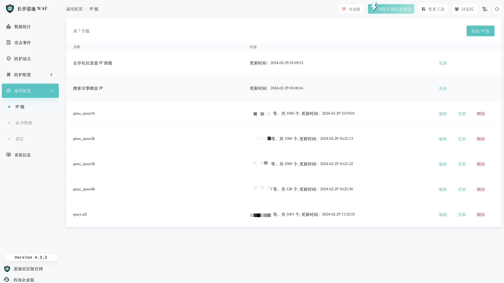

# 基于威胁捕捉与诱骗系统的地址库

* 每日自动推送来自互联网的攻击溯源信息。
  
  * 可应用于雷池Safeline IP组订阅功能。

## Github源

``` wget https://raw.githubusercontent.com/TScci/threatips/main/threatips.txt ```

## Gitee源

``` wget https://gitee.com/tscci/threatips/raw/main/threatips.txt ```

# [雷池SafelineIP数量限制问题](https://github.com/chaitin/SafeLine/issues/632)



* 解决办法:通过定时任务将IP按1000为一组拆分。

## Github源
  
``` wget https://raw.githubusercontent.com/TScci/threatips/main/ipset1k.txt ```

``` wget https://raw.githubusercontent.com/TScci/threatips/main/ipset2k.txt ```

``` wget https://raw.githubusercontent.com/TScci/threatips/main/ipset3k.txt ```

``` wget https://raw.githubusercontent.com/TScci/threatips/main/ipset4k.txt ```

## Gitee源

``` wget https://gitee.com/tscci/threatips/raw/main/ipset1k.txt ```

``` wget https://gitee.com/tscci/threatips/raw/main/ipset2k.txt ```

``` wget https://gitee.com/tscci/threatips/raw/main/ipset3k.txt ```

``` wget https://gitee.com/tscci/threatips/raw/main/ipset4k.txt ```
